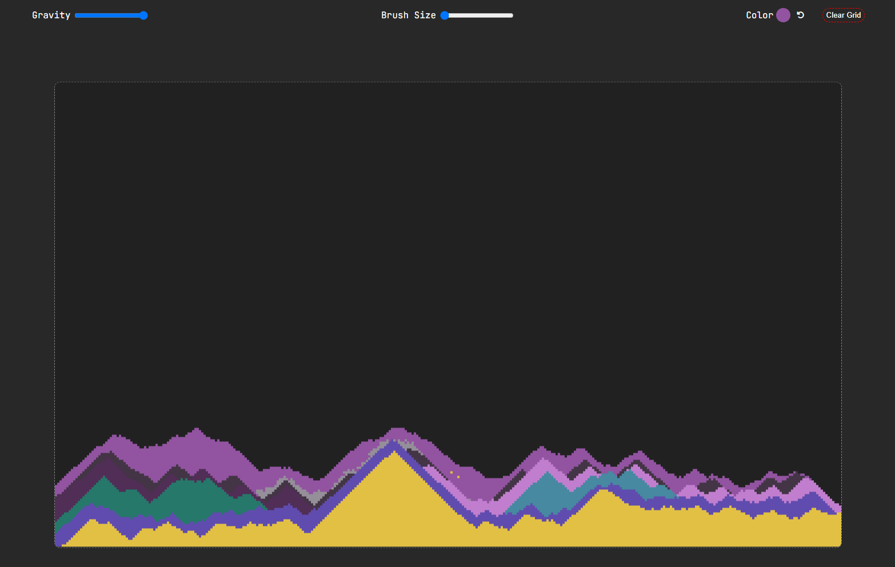

# Sand Simulation Project

#### Try it out [here](https://sand-sim.d7om.dev)



## Overview

This project is a sand simulation built with TypeScript and PIXI.js. It's a fun and interactive way to simulate the physics of sand particles. You can add particles to the simulation, change their color, and watch as they interact with each other.

## Features

- **Particle System**: The core of the simulation is a particle system where each particle is represented as an instance of a `Particle` class or its subclass `Sand`. The particles can interact with each other, simulating the physics of sand.
- **Color Selection**: You can change the color of the particles that you add to the simulation.
- **Responsive Design**: The sand simulation is designed to work seamlessly on both PC and mobile devices.

## How to Run

To run this project, you need to have Node.js and pnpm installed. Then, you can install the dependencies and start the development server with the following commands:

```sh
pnpm install
pnpm start
```

To build the project for production, use the following command:

```sh
pnpm run build
```

The built files will be located in the `dist/` directory.

## Contributing

Contributions to this project are welcome. If you find a bug or have an idea for a new feature, please open an issue. If you want to contribute code, please fork the repository and submit a pull request.

## License

This project is licensed under the MIT License. See the [LICENSE](LICENSE) file for more information.

```

```
